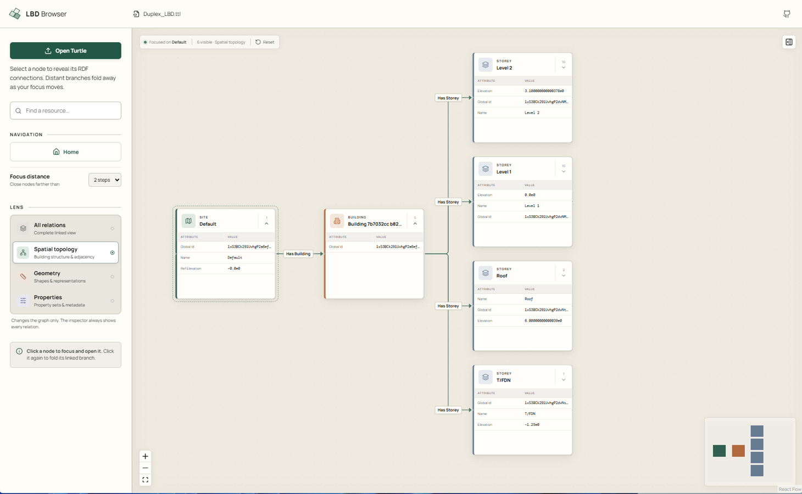

# LBD Browser

LBD Browser is an interactive graph viewer for **Linked Building Data (LBD)** stored as RDF/Turtle. It turns a large Turtle document into a navigable building graph: start from the site, follow the spatial hierarchy, inspect geometry, and read IFC properties without having to understand every intermediate RDF node.

The application is designed for Turtle produced by [IFCtoLBD](https://github.com/jyrkioraskari/IFCtoLBD), while remaining useful for other RDF datasets that use the [Building Topology Ontology (BOT)](https://w3id.org/bot/).



## What problem does it solve?

An IFC-to-RDF conversion can contain thousands of resources and several kinds of relationships at once:

- spatial containment, such as a site containing a building;
- building-element relationships, such as a space adjacent to a wall;
- links to geometric representations;
- IFC attributes;
- property and quantity values represented at different OPM levels.

Displaying all of these triples simultaneously quickly produces an unreadable graph. LBD Browser therefore combines two ideas:

1. **Focused navigation** limits the visible graph to a small number of steps around the selected resource.
2. **Lenses** select which kinds of relationships are used on the graph without changing the underlying RDF model.

The complete model remains available for navigation and inspection; a Lens only changes what is drawn on the canvas.

## Quick start

You need a current Node.js installation with npm.

```bash
npm install
npm run dev
```

Open the local address printed by Vite, normally `http://localhost:5173`.

The bundled `Duplex_LBD.ttl` example is loaded automatically. Its graph starts at the selected root and opens **two steps**. To inspect your own data, select **Open Turtle** or drag a `.ttl` file onto the application. Turtle parsing takes place locally in the browser; the selected file is not uploaded by the application.

## Reading the graph

Each node represents an RDF resource. The node colour and type label distinguish sites, buildings, storeys, spaces, elements, and general resources. Directed arrows represent RDF predicates: the arrow points from the triple's subject to its object, and its label names the predicate.

For example:

```text
Building --bot:hasStorey--> Storey --bot:hasSpace--> Space
```

The application chooses its initial root as follows:

1. the `bot:Site` in the largest connected component;
2. otherwise, a suitable BOT building, element, or zone;
3. otherwise, the best available RDF root.

This makes the starting point predictable for normal building models while still allowing less conventional Turtle documents to open.

## Navigating a model

- **Select a node** to make it the focus and reveal its incoming and outgoing connections.
- **Select the focused node again** to fold its branch.
- **Drag nodes** to adjust their positions. Manually positioned nodes remain where they were placed while the visible graph changes.
- Use **Focus distance** to keep resources within one, two, or three graph steps of the focused node.
- Use **Home** to return to the model root and reopen the graph to two steps.
- Use **Find a resource** to locate a resource by its label or URI.
- Pan and zoom on the canvas, or use the controls and minimap.

The default model and the Home action are intentionally expanded rather than collapsed, so the first two levels of the building structure are immediately visible.

## Lenses

A Lens is a navigation filter. It controls which resource-to-resource links are shown and followed on the graph.

| Lens | Purpose | Typical links |
| --- | --- | --- |
| **All relations** | Shows the linked RDF structure without expanded attribute, property, or quantity tables in nodes. | All supported resource links |
| **Spatial topology** | Concentrates on the building's spatial organization. | `bot:hasBuilding`, `bot:hasStorey`, `bot:hasSpace`, zone relations |
| **Geometry** | Follows elements and their geometric context. | `bot:containsElement`, `bot:adjacentElement`, `bot:interfaceOf`, `omg:hasGeometry`, FOG/geometry relations |
| **Properties** | Presents IFC property and quantity information as grouped set nodes. | Property-set and quantity-set links |

The basic BOT navigation backbone—`bot:hasBuilding`, `bot:hasStorey`, and `bot:hasSpace`—is retained in every Lens. In the Geometry and Properties lenses these contextual topology links are dashed, making them visually distinct from the Lens-specific links.

High-cardinality relations are normally limited during branch expansion to keep the graph responsive. Important structural cases are preserved: all `bot:hasStorey` links are available in the Spatial topology Lens, and Geometry does not cap adjacent-element or interface links.

## Property and quantity sets

IFCtoLBD can encode values at different [Ontology for Property Management (OPM)](https://w3id.org/opm/) levels. The RDF structures are useful for machines, but displaying every property and state as a separate graph node is cumbersome for people. The Properties Lens therefore normalizes these representations into one visual pattern.

### OPM levels in the interface

| Representation | RDF shape, simplified | Presentation in LBD Browser |
| --- | --- | --- |
| **Level 1** | Element predicate points directly to a literal value. | The value is assigned to its inferred IFC property or quantity set. |
| **Level 2** | Element links to an `opm:Property` carrying `schema:value`. | The intermediate property is converted into a name–value row. |
| **Level 3** | An `opm:Property` links to an `opm:CurrentPropertyState`, which carries the current value and provenance. | The current state value is shown as a name–value row; available unit and state metadata are retained by the model. |

In the Properties Lens:

- properties are removed from the graph as individual low-level nodes;
- values are grouped by IFC property set, such as `Pset_WallCommon`;
- each set becomes one node connected to its original building element;
- the set node contains a **Property / Value** table;
- quantity sets such as `Qto_WallBaseQuantities` are handled in the same way and use a **Quantity / Value** table;
- values include their unit when one is available.

The grouping supports both explicit property-set resources and level-1 data where the set must be inferred from IFCtoLBD predicate metadata. When an explicit set node does not exist, the browser creates an in-memory presentation node; it does not alter the source Turtle file.

## IFC attributes

General IFC attributes—such as a GlobalId or object name—are different from property-set values. Outside the All relations Lens, their low-level links are folded into the owning building resource and displayed as an **Attribute / Value** list inside that resource's node.

This applies to direct literal attributes and OPM level 2/3 attribute resources. The goal is to keep identifying information close to the building element while avoiding a branch of technical RDF nodes for every attribute.

## Geometry

The Geometry Lens includes geometry and element-context relations, notably:

- `bot:containsElement`;
- `bot:adjacentElement`;
- `bot:interfaceOf`;
- `omg:hasGeometry`;
- predicates from OMG and FOG, plus common geometry, representation, mesh, shape, and bounding-box relations.

When an element has Base64-encoded OBJ data through `omg:hasGeometry` and `fog:asObj_v3.0-obj`, the element node displays a lightweight isometric preview. The geometry literal itself is not drawn as a graph node.

## Resource Inspector

The Resource Inspector is hidden by default to maximize canvas space and can be opened from the interface when detailed RDF information is needed. It shows the selected resource's URI, types, attributes, grouped property and quantity values, and incoming and outgoing links.

Unlike a Lens, the inspector is intended to expose the selected resource's details rather than simplify graph navigation.

## Loading and performance

Turtle is parsed with [N3.js](https://github.com/rdfjs/N3.js) and indexed in memory. The viewer then lays out only the currently visible subgraph instead of rendering the entire model. This is important for IFC-derived documents, where geometry literals and property structures can make the source file large.

For a smoother experience with large models:

- begin with one or two focus steps;
- use the most specific Lens for the task;
- expand branches progressively;
- avoid opening every relation in a dense region at once.

Initial parsing time still depends on file size, Turtle complexity, and the browser/device. After parsing, focused navigation avoids repeatedly drawing the full dataset.

## Supported input

The file picker accepts `.ttl` and `.turtle` files with the `text/turtle` media type. The viewer understands general RDF resource links and adds purpose-built behavior for:

- BOT spatial topology;
- OMG and FOG geometry links;
- embedded OBJ geometry;
- IFCtoLBD `props:` predicates;
- OPM property and current-state resources;
- IFC property sets (`Pset_*`) and quantity sets (`Qto_*`).

Relative IRIs are resolved against the local base IRI `https://local.lbd/`.

## Development

The project is a client-side React and TypeScript application built with Vite.

| Component | Role |
| --- | --- |
| React 19 | User interface and application state |
| React Flow | Interactive graph canvas |
| Dagre | Left-to-right graph layout |
| N3.js | Turtle parsing |
| Vitest | Graph-model and normalization tests |

Useful commands:

```bash
# Start the development server
npm run dev

# Run the test suite once
npm test

# Type-check and create a production build
npm run build

# Preview the production build locally
npm run preview
```

The production output is written to `dist/`.

### Source layout

```text
src/App.tsx              Application shell, navigation, and graph state
src/graph.ts             Turtle model, relation filters, and OPM normalization
src/graph.test.ts        Tests for graph behavior and RDF representations
src/BuildingNode.tsx     Building, attribute, and property-set nodes
src/RelationEdge.tsx     Directed relation rendering
src/GeometryPreview.tsx  Embedded OBJ preview component
src/geometry.ts          OBJ-to-preview conversion
src/styles.css           Interface and graph styling
```

## Verification

Before contributing a change, run:

```bash
npm test
npm run build
```

The tests cover root selection, navigation distance, Lens classification, uncapped structural relations, embedded geometry, OPM levels, property and quantity grouping, and IFC attribute folding.

## Related vocabularies and tools

- [IFCtoLBD](https://github.com/jyrkioraskari/IFCtoLBD) — converts IFC models into Linked Building Data.
- [BOT](https://w3id.org/bot/) — describes building topology and element relationships.
- [OPM](https://w3id.org/opm/) — represents properties and their changing states.
- [OMG](https://w3id.org/omg/) — links objects to geometry descriptions.
- [FOG](https://w3id.org/fog/) — describes geometry formats and serializations.

## Current scope

LBD Browser is an exploratory viewer, not an RDF editor. Generated grouping nodes and layout changes exist only in browser memory. Opening a model does not modify the Turtle source, and the application currently does not save an edited graph back to disk.
